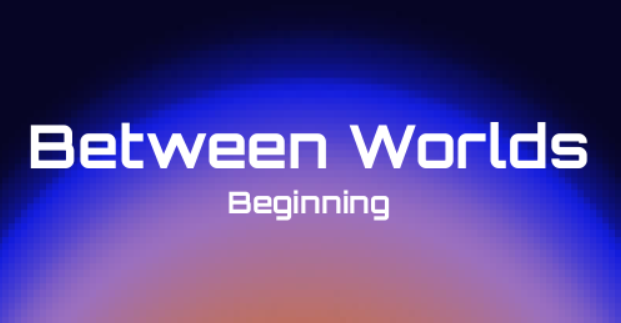
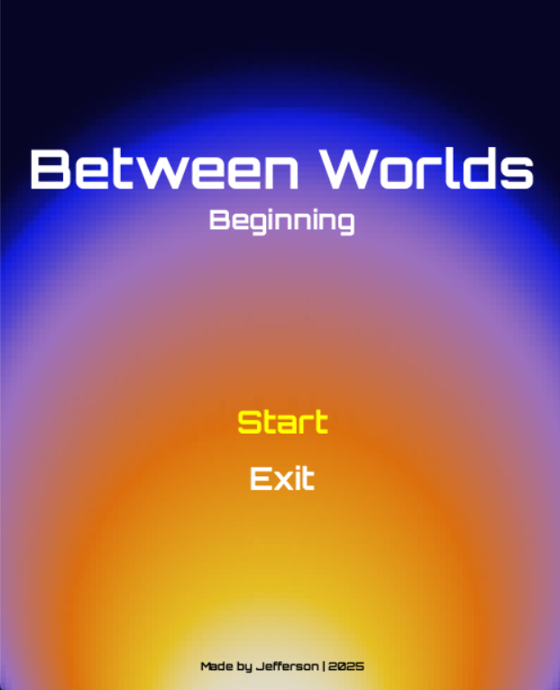
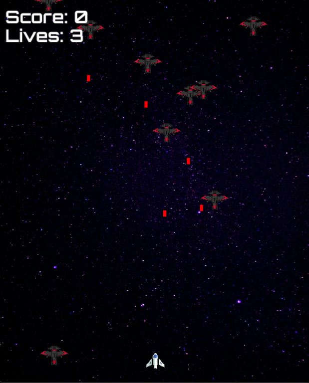
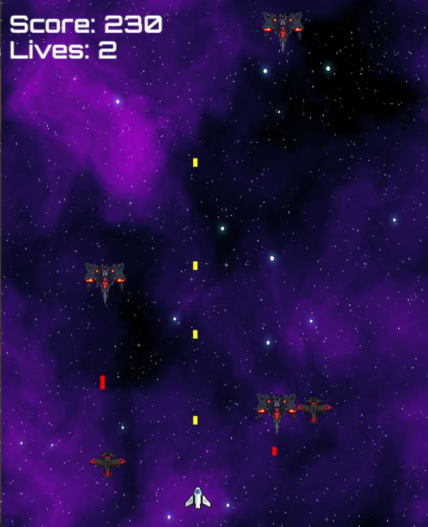

Leia em [🇺🇸 Inglês](README.md)

<p align="center">
  
</p>

"Between Worlds: Beginning" é um empolgante jogo de tiro 2D no espaço, onde você navega sua nave por entre inimigos hostis e fases desafiadoras. Sobreviva às ondas de ataques, evite os tiros inimigos e tente alcançar a maior pontuação enquanto avança por níveis cada vez mais difíceis. Você está pronto para entrar na batalha entre mundos?

> Este jogo foi desenvolvido como um projeto para o meu curso de graduação em Análise e Desenvolvimento de Sistemas, como parte da matéria de Linguagem de Programação Aplicada. O objetivo era criar um jogo 2D usando Python e Pygame, aplicando os conceitos de programação aprendidos durante o curso.

## Como jogar 🎮

- Use ← e → para mover a nave espacial.
- Pressione ESPAÇO para atirar nos inimigos.
- Evite colisões com inimigos e seus projéteis.
- Você tem 3 vidas. O jogo termina quando suas vidas chegam a zero.
- Sobreviva 40 segundos na Fase 1 para avançar para a Fase 2.

## Capturas de tela

<p align="center">
  
  
  
</p>


## Instalação

1. Clone o repositório:

```bash
git clone https://github.com/carvalho-jefferson/between-worlds-beginning.git
```

2. Entre na pasta do projeto:

```bash
cd between-worlds-beginning
```

3. Crie um ambiente virtual (opcional, mas recomendado):

```bash
python -m venv .venv
```

4. Ative o ambiente virtual:

- Windows:

```bash
.venv\Scripts\activate
```

- Linux/Mac:

```bash
source .venv/bin/activate
```

5. Instale as dependências:

```bash
pip install -r requirements.txt
```

## Créditos

Gostaria de agradecer a todos os artistas que disponibilizaram suas obras publicamente, o que tornou este projeto possível. 🙂

- Desenvolvedor do jogo: [Jefferson Carvalho](https://github.com/carvalho-jefferson)
- Imagens de fundo: [Jeremy Perkins](https://unsplash.com/pt-br/fotografias/noite-estrelada-FsK54FVNRfM), [Screaming Brain Studios](https://screamingbrainstudios.itch.io/seamless-space-backgrounds), [Andrei Castanha](https://unsplash.com/pt-br/ilustra%C3%A7%C3%B5es/gradiente-abstrato-de-cores-quentes-NT5iRPa3v4k)
- Sprites de jogador/inimigo: [Foozle](https://foozlecc.itch.io/void-main-ship), [gishadev](https://gisha.itch.io/spaceships-asset-pack), [ScratchBattles](https://squaremeapixel.itch.io/space-pack)
- Fonte: Orbitron (Google Fonts)
- Sons: [cynicmusic.com](https://opengameart.org/content/enchanted-tiki-86), [Unknown](opengameart.org/content/tower-defense-theme), [Unknown](opengameart.org/content/let-the-games-begin-0)
