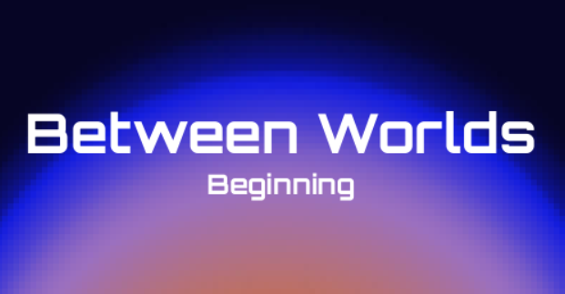
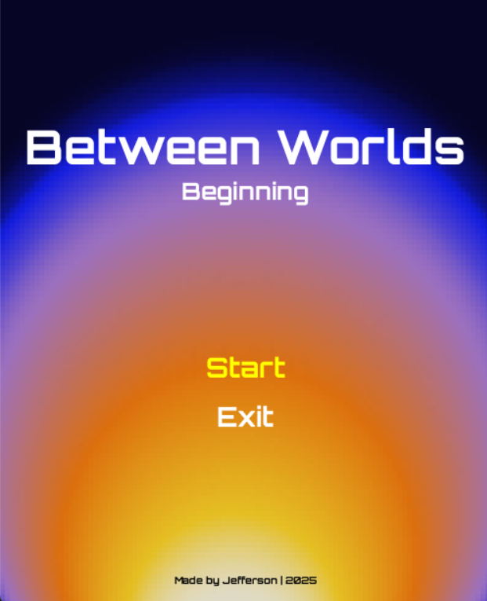
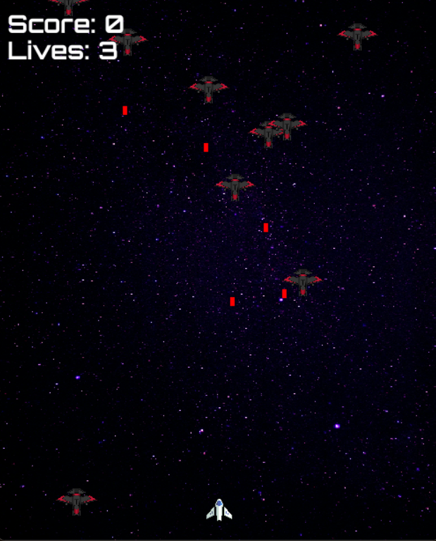

Read this in [🇧🇷 Portuguese](README-pt.md)

<p align="center">
  
</p>

"Between Worlds: Beginning" is an exciting 2D space shooter where you navigate your spaceship through hostile enemies and challenging phases. Survive waves of attacks, avoid enemy fire, and aim for the highest score as you progress through increasingly difficult levels. Are you ready to enter the battle between worlds?

> This game was developed as a course project for my undergraduate program in Analysis and Systems Development (ADS), as part of the Applied Programming Languages subject. The objective was to create a playable 2D game using Python and Pygame, applying the programming concepts learned during the course.

## How to Play 🎮

- Use **← and →** to move the spaceship.
- Press **SPACE** to shoot enemies.
- Avoid collisions with enemies and their projectiles.
- You have **3 lives**. The game ends when your lives reach zero.
- Survive **40 seconds** in Phase 1 to advance to Phase 2.

## Screenshots

<p align="center">
  
  
  
</p>


## Installation

1. Clone the repository:

```bash
git clone https://github.com/carvalho-jefferson/between-worlds-beginning.git
```

2. Enter the project folder:

```bash
cd between-worlds-beginning
```

3. Create a virtual environment (optional but recommended):

```bash
python -m venv .venv
```

4. Activate the virtual environment:

- Windows:

```bash
.venv\Scripts\activate
```

- Linux/Mac:

```bash
source .venv/bin/activate
```

5. Install dependencies:

```bash
pip install -r requirements.txt
```

## Credits

I would like to sincerely thank all the artists who made their works publicly available, which made this project possible. 🙂

- Game development: [Jefferson Carvalho](https://github.com/carvalho-jefferson)
- Background images: [Jeremy Perkins](https://unsplash.com/pt-br/fotografias/noite-estrelada-FsK54FVNRfM), [Screaming Brain Studios](https://screamingbrainstudios.itch.io/seamless-space-backgrounds), [Andrei Castanha](https://unsplash.com/pt-br/ilustra%C3%A7%C3%B5es/gradiente-abstrato-de-cores-quentes-NT5iRPa3v4k)
- Enemy/Player sprite: [Foozle](https://foozlecc.itch.io/void-main-ship), [gishadev](https://gisha.itch.io/spaceships-asset-pack), [ScratchBattles](https://squaremeapixel.itch.io/space-pack)
- Font: Orbitron (Google Fonts)
- Sounds: [cynicmusic.com](https://opengameart.org/content/enchanted-tiki-86), [Unknown](opengameart.org/content/tower-defense-theme), [Unknown](opengameart.org/content/let-the-games-begin-0)
